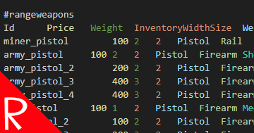

# Quasimorph Simple Data Loader

A simple utility which can export the game's data and also allows users to change the values.

This is useful for users who want to see the values and/or modify them for local use.

The data includes items, drop rates, mercs, etc.

### Data Export Mod
If the user only needs to view the data, consider using the "Data Export" mod as it is much less likely to break with game updates.

## Warning

When a new version of the game is released, the import directory for this mod should be deleted and the game run again to export the latest data. 
Otherwise the game may crash or cause game corruption.

Due to how this mod currently works, it has a high chance of breaking on new versions of the game. If there are any issues, unsubscribe from the mod.

# Usage

## Source Data

When the game is run, the game's config_* files will be exported to the `%AppData%\..\LocalLow\Magnum Scriptum Ltd\Quasimorph_ModConfigs\QM_SimpleDataLoader\Export` folder.
This data will be replaced on every game run.

The localization data is also exported, but currently is not imported.

### Data Overview
The files often contain more than one table, with each table starting with a `#<table name>`

The item ids generally do not match the name displayed in the game, so the user will need to find the actual item ids themselves.  

The debug's console command `itemscan` allows the user to mouse over an item to get the id.

## Change Data

To modify the data, make a change to a file or files in the Export folder and copy them to the Import folder found at `%AppData%\..\LocalLow\Magnum Scriptum Ltd\Quasimorph_ModConfigs\QM_SimpleDataLoader\Import`

When the game is run, the changes will be imported.

It should be possible to add or remove items, but I have not tried that.  

### Important Notes

The file formats must be exactly as they are exported. The values can be modified, but any spaces, tabs, new lines, etc. must be identical in format.

Note that some editors such as Visual Studio Code will convert the tab key to spaces instead of a tab.  The game requires tabs to delineate columns and must not be spaces.

# Configuration

The configuration file will be created on the first game run and can be found at `config.json`.

|Name|Default|Description|
|--|--|--|
|DumpData|true|If true, exports the `config_*` files to the export directory|

# Support
If you enjoy my mods and want to buy me a coffee, check out my [Ko-Fi](https://ko-fi.com/nbkredspy71915) page.
Thanks!

# Source Code
Source code is available on GitHub at https://github.com/NBKRedSpy/QM-SimpleDataLoader

# Change Log

# 2.1.2
* Added 0.9.5 resources

# 2.1.1
* Support for v.0.8.5
* Changed file extensions from .txt to .tsv to match the Data Export Mod.
* Exports localization data.

# 2.1.0
* Moved config file directory.

# 2.0.1
Added the new config_difficulty for version .8

# 2.0.0
Converted to Steam Workshop

# 1.0.0
Release